# BISKIT

## 프로젝트 개요

이 저장소는 프론트엔드, 백엔드, AI 서비스로 구성된 웹 애플리케이션을 위한 모노레포입니다. 이 프로젝트는 Docker를 사용하여 완전히 컨테이너화되었습니다.

- **Frontend:** React, TypeScript, [Next.js](https://nextjs.org/) 기반의 애플리케이션입니다. [Tailwind CSS](https://tailwindcss.com/)를 사용한 스타일링, [Radix UI](https://www.radix-ui.com/)를 통한 접근성 높은 컴포넌트 구현, [Zustand](https://github.com/pmndrs/zustand)를 이용한 상태 관리, 그리고 [React Query](https://tanstack.com/query/latest)를 통한 서버 상태 관리 및 캐싱을 특징으로 합니다.

- **Backend:** Java 21과 Gradle을 사용하는 [Spring Boot](https://spring.io/projects/spring-boot) 애플리케이션입니다. 비즈니스 로직, 사용자 인증, 데이터 영속성을 처리합니다. 주요 기술로는 Spring Data JPA, Spring Security (JWT 및 OAuth2 포함), Spring Web이 있습니다.

- **AI Service:** Python 기반의 [FastAPI](https://fastapi.tiangolo.com/) 애플리케이션입니다. PyTorch, Pandas, OpenAI와 같은 라이브러리를 사용하여 머신러닝 모델을 서빙하고 AI 기반 기능을 제공합니다.

## 기술 스택

- **Frontend:** Next.js, React, TypeScript, Tailwind CSS, Radix UI, Zustand, React Query
- **Backend:** Spring Boot, Java 21, Gradle, Spring Data JPA, Spring Security, JWT, OAuth2
- **AI Service:** FastAPI, Python, PyTorch, Pandas, OpenAI
- **Database & Caching:** MySQL, Redis
- **CI/CD & Deployment:** Docker, Jenkins, Nginx

## 아키텍처

본 프로젝트는 Docker Compose를 통해 관리되는 세 개의 컨테이너화된 서비스로 구성된 모노레포 아키텍처를 따릅니다.

1.  **Frontend (Next.js)**: 사용자와의 상호작용을 담당하는 웹 애플리케이션입니다. Nginx를 웹 서버로 사용하며, 백엔드 API와는 `next.config.ts`에 설정된 프록시를 통해 통신합니다.
2.  **Backend (Spring Boot)**: 핵심 비즈니스 로직과 데이터 처리를 담당합니다. Frontend로부터의 요청을 받아 데이터베이스(MySQL)와 상호작용하고, 필요한 경우 AI 서비스에 요청을 보냅니다.
3.  **AI Service (FastAPI)**: 머신러닝 모델을 기반으로 한 AI 기능을 제공합니다. Backend 서비스의 요청에 따라 데이터 분석, 추천 등의 작업을 수행하고 결과를 반환합니다.

모든 서비스는 Docker 내부 네트워크를 통해 서로 통신하여 안전하고 효율적인 데이터 교환을 보장합니다.

## 주요 기능

- **AI 기반 상권 및 입지 추천**: 사용자의 요구사항에 맞춰 AI가 최적의 상권, 건물, 점포 등을 추천합니다.
- **지도 기반 시각화**: 지도 위에 추천 매물, 상권 정보 등을 시각적으로 표시하여 직관적인 정보 확인이 가능합니다.
- **사용자 인증**: JWT와 OAuth2를 이용한 안전한 소셜 로그인 및 회원 관리 기능을 제공합니다.
- **AI 분석 및 서베이**: AI를 활용한 사용자 맞춤형 서베이 및 데이터 분석 기능을 제공합니다.
- **점포 및 카테고리 관리**: 다양한 카테고리별로 점포를 검색하고 관리할 수 있습니다.
- **마이페이지**: 사용자는 자신의 프로필과 즐겨찾기 등 개인화된 정보를 관리할 수 있습니다.
- **실시간 채팅**: 사용자 간의 실시간 소통을 위한 채팅 기능을 제공합니다.

## 빌드 및 실행

전체 애플리케이션은 Docker Compose로 실행되도록 설계되었습니다.

### 운영/Jenkins 배포

Jenkins 파이프라인 (`Jenkinsfile`)이 배포 과정을 자동화합니다. `docker-compose.yml`과 `docker-compose.prod.yml`을 함께 사용하여 서비스를 빌드하고 실행합니다.

- **빌드 명령어:** `docker compose -f docker-compose.yml -f docker-compose.prod.yml build --no-cache`
- **실행 명령어:** `docker compose -f docker-compose.yml -f docker-compose.prod.yml up -d`
- **중지 및 정리 명령어:** `docker compose -f docker-compose.yml -f docker-compose.prod.yml down -v`

### 로컬 개발

로컬 개발의 경우, 핫 리로딩과 같은 기능을 활성화하는 `docker-compose.override.yml` 파일을 사용할 수 있습니다.

- **실행 명령어:** `docker-compose up --build`
- **중지 명령어:** `docker-compose down`

각 서비스를 개별적으로 실행할 수도 있습니다.

- **Frontend:**

  ```bash
  cd frontend
  yarn dev
  ```

- **Backend:**

  ```bash
  cd backend
  ./gradlew bootRun
  ```

- **AI Service:**
  ```bash
  cd ai
  uvicorn app.main:app --reload
  ```

## 스크린샷

*참고: 이미지는 임의로 할당되었으므로, 실제 내용과 맞게 수정해주세요.*

### 메인 화면
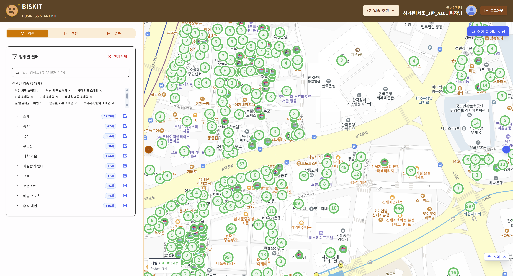

### 로그인 화면
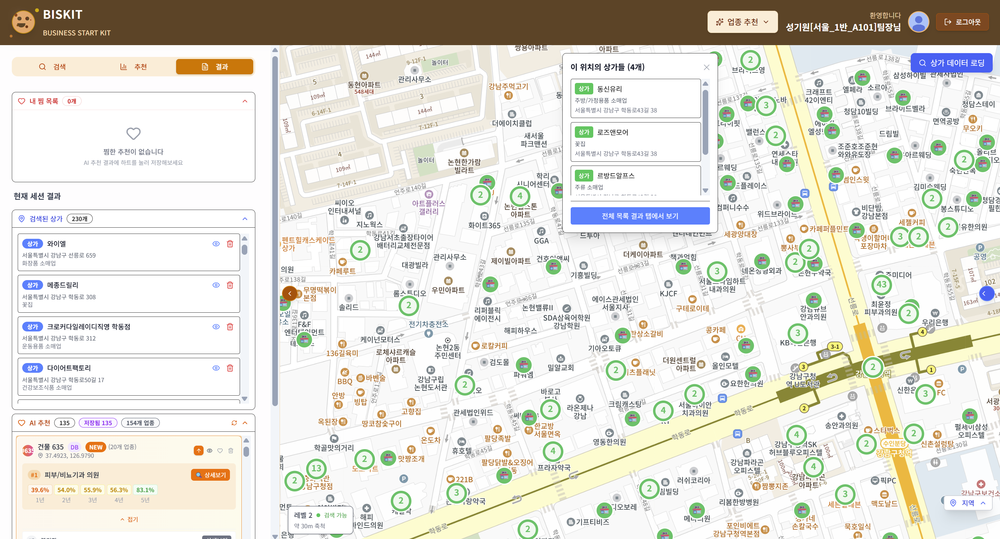

### 대시보드 화면
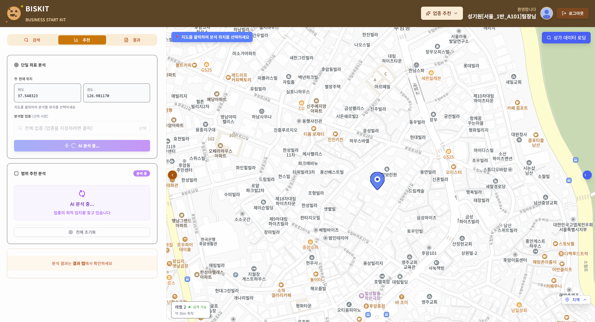

### 회원가입 화면
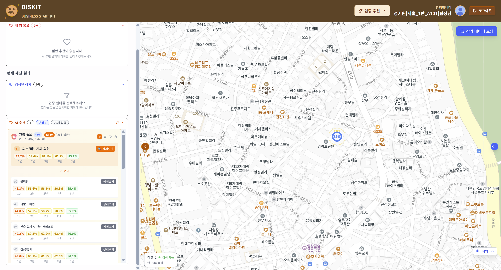

### 팀 생성 화면
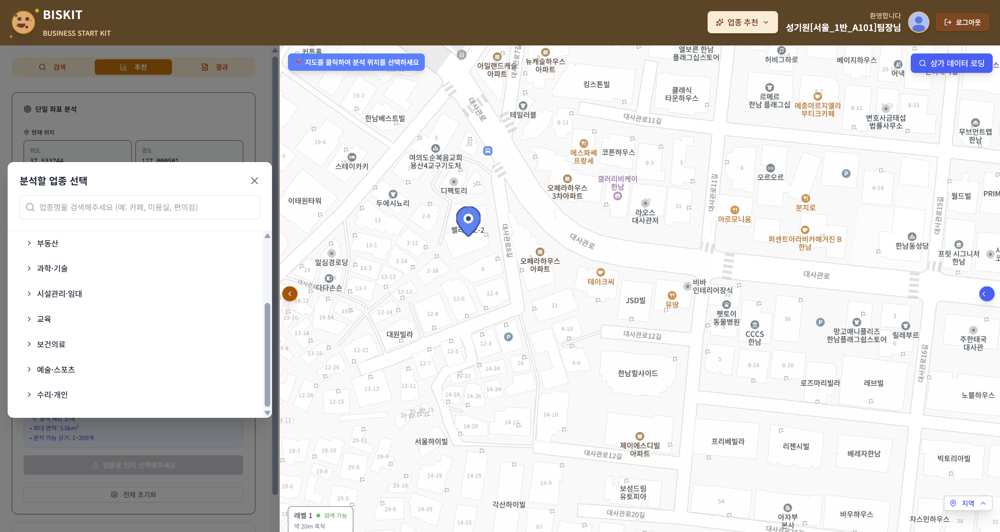

### 팀 페이지 화면
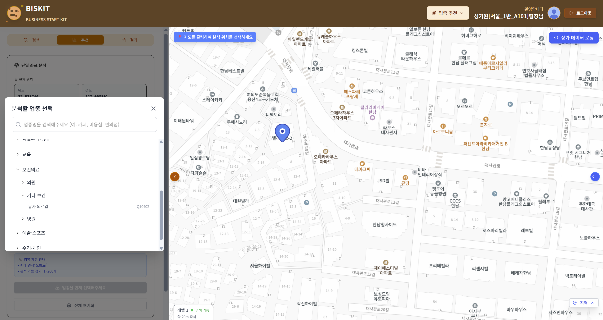

### AI 추천 화면
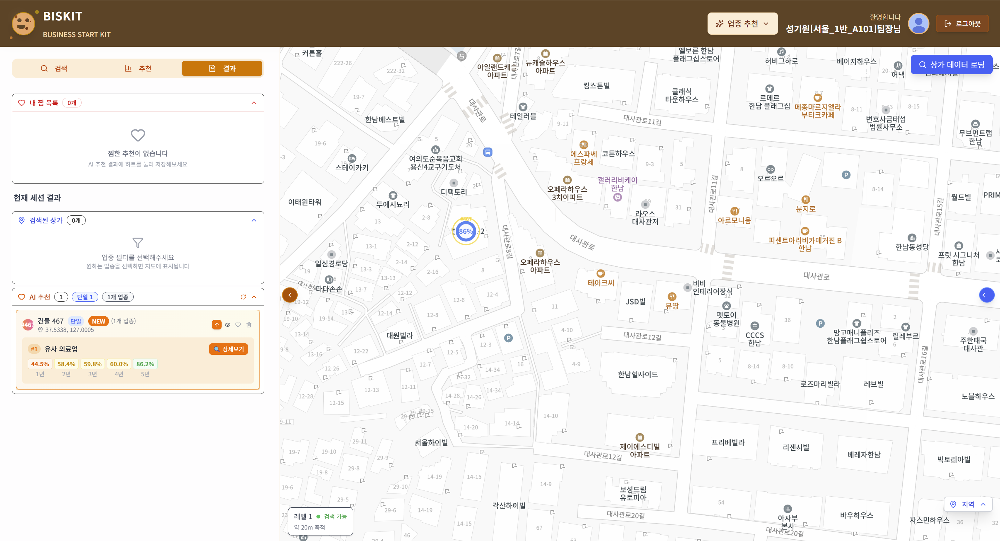

### 대기자 등록 화면
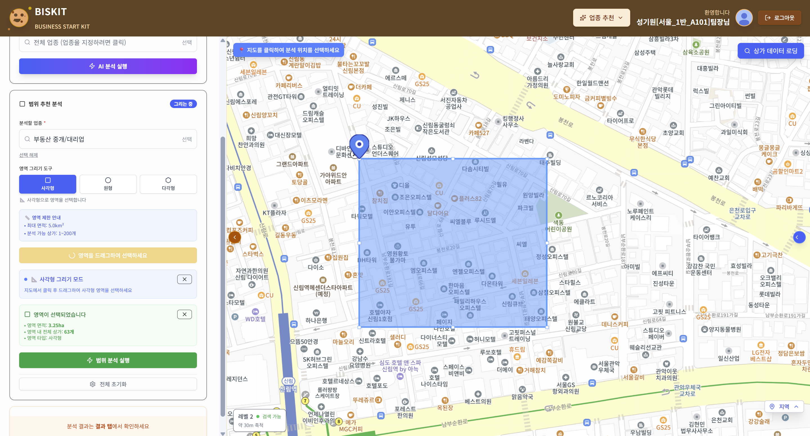
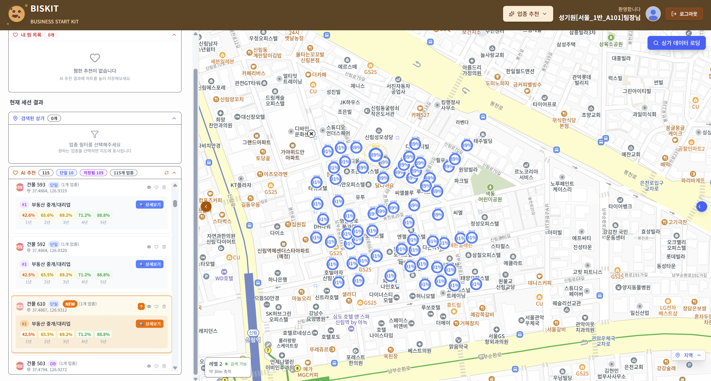

### 대기자 상세보기 모달
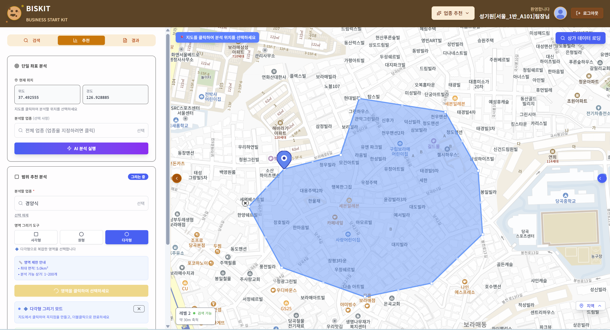

### 팀 상세보기 모달
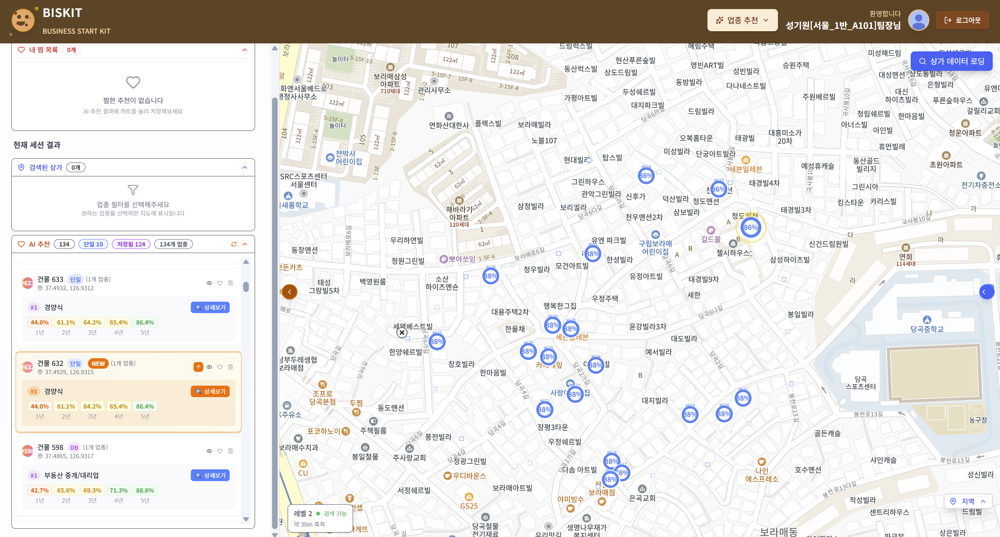

### 알림 화면
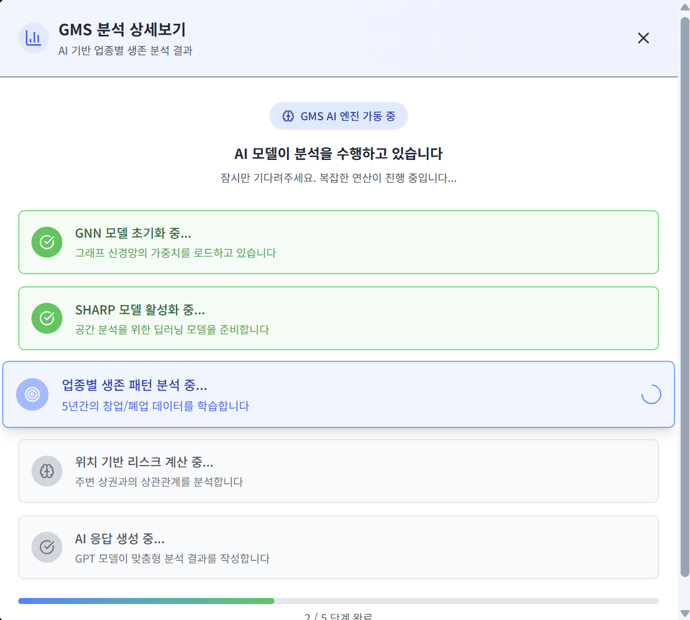

## 기여도와 역할

**성기원**: 팀장, 백엔드

- 백엔드 추천 도메인 개발

**강 건**: 팀원, 풀스택

- 주요 화면 개발 상가 검색 로직 개발

**김승민**: 팀원, 백엔드

- oauth2 채팅 기능 개발

**이승주**: 팀원, 프론트 인프라

- 로그인 추천화면 개발, 인프라 구축

**강한설**: 팀원, ai

- GNN 추천, SHARP 설명 모델 개발

**문종원**: 팀원, ai

- GNN 추천

## 배운 점

인프라를 담당하며 인프라에 더 많은 요소가 존재함을 알았다. api호출의 성능을 검사하는 툴이라거나 CI에 코드검증을 진행하는 플러그인 또는 코드리뷰와 같은 추가 기능이 존재함을 알았다. 추가적인 학습과 컴포넌트 구조에대한 아키텍처 공부도 필요해 보인다.
